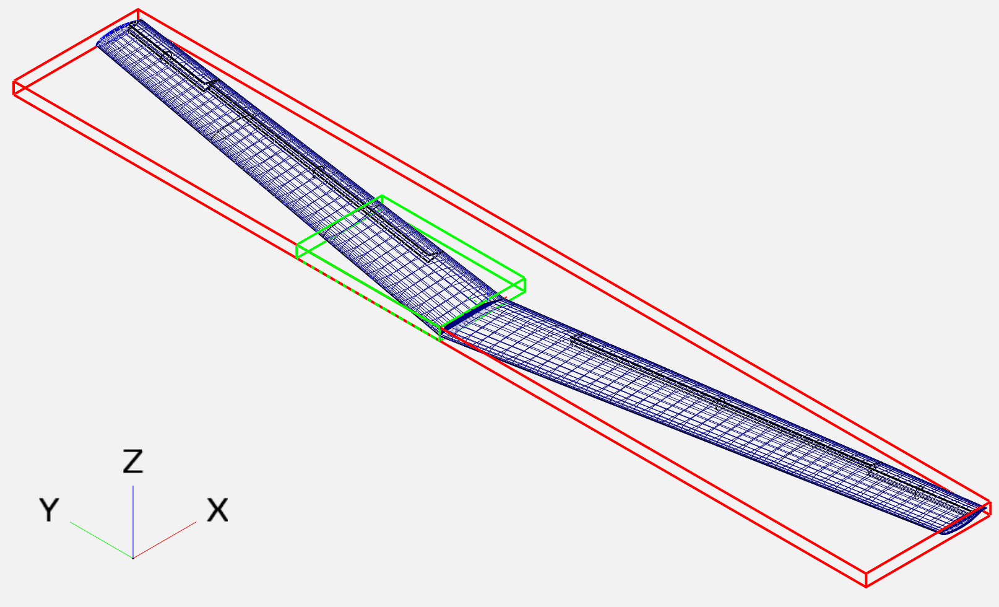

Geometry Generation
===================

The NASA tiltwing vehicle geometry is provided open access online, at the OpenVSP hangar.
This geometry can be opened locally in OpenVSP, and manipulated as desired.
For this case, the wing alone is used as the baseline design for the analyses and optimizations.
To export the wing, open the file with OpenVSP and use show / hide commands to isolate the wing.
Be sure to hide all of the components of the fuselage and tail as well as the nacelles and blades associated with the wing.
The isolated wing should match the image below.

   NASA tiltwing wing geometry rendered in OpenVSP.

Once the wing is isolated, use the toolbar to export the desired file format.
When using Pointwise, STEP files are used most frequently, but other file formats can work for other tools.

.. note::

   Take note of the units of the model and the tool you use in the subsequent steps for meshing.
   Ensure that everything is scaled correctly -- to match the provided parametrizations and runscripts, convert all dimensions to SI units.