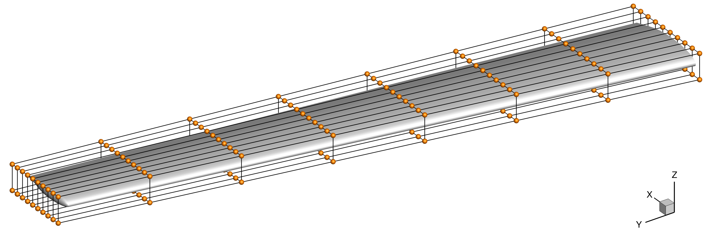

Geometry Parameterization
=========================

Aerodynamic shape optimization is dependent on a flexible geometry parameterization that can deform the underlying geometry freely, with parameterized variables.
This can be accomplished with free-form deformation (FFD), a technique that originates in the computer graphics field.
The underlying theory behind FFD grids is embedding points within a volume that can be deformed as a jello-like material.
By displacing individual points and rotating sections of the FFD block, the geometry can be deformed to generate a new design.
When applied to wings, free-form deformation grids are used to embed complete lifting surface.
The grid can then be parameterized to impart changes to the twist, chord, sweep, span, diheral, and shape of the wing.
In this work, only the twist and shape variables are used to optimize the shape of the NASA tiltwing's wing.

The FFD grid is generated using a Python script that writes a ``.xyz`` file.
This file is read by `pyGeo` at the start of the optimization.
The script requires few dependencies, in this case only `numpy` and the default `sys` packages.

.. literalinclude:: ../../../wingOnly/FFD/generateFFD.py
    :end-before: # rst write file

The first step for generating the FFD grid is define the corners of the box.
In this case, we use a single-block grid that consists of ten points in the X-direction, eight in the Y-direction, and two in the Z-direction.
We define these into an array that is dimension ``nBlocks`` by ``nY`` by ``3``.
Once the corners of the box are define, we pass it to the function ``returnBlockPoints()``.

.. literalinclude:: ../../../wingOnly/FFD/generateFFD.py
    :start-after: # rst define block
    :end-before: # rst write block

The ``returnBlockPoints()`` function takes in the corners defined for a single block, and returns the corresponding FFD grid.
This is done by creating a set of linearly spaced arrays of values between the bounds in the X-, Y-, and Z-directions.
These arrays are used to generate the entire grid and are returned as a single array of points.

.. literalinclude:: ../../../wingOnly/FFD/generateFFD.py
    :start-after: # rst return block
    :end-before: # rst define block

Once the FFD block is generated, we write it to a file.
This is carried out using the ``writeFFDFile()`` function that takes the file name, number of blocks, number of points in each direction, and the FFD grid point array.

.. literalinclude:: ../../../wingOnly/FFD/generateFFD.py
    :start-after: # rst write block

The ``writeFFDFile()`` function writes out the FFD grid in ``.xzy`` format.
This format first includes the number of points in each direction, followed by the X-coordinates, Y-coordinates, and Z-coordinates.
The file is a simple plain text file that can be read in to pyGeo, as well as visualization tools such as TecPlot and Paraview.

.. literalinclude:: ../../../wingOnly/FFD/generateFFD.py
    :start-after: # rst write file
    :end-before: # rst return block

To generate the FFD grid, navigate to the ``wingOnly/FFD/`` directory and run the ``generateFFD.py`` script:

.. prompt:: bash

    python generateFFD.py

Once this generates the ``wingFFD.xyz`` file, visualize it using TecPlot or Paraview.
The FFD grid is as shown below, surrounding the tiltwing's wing geometry.

   Free-form deformation grid around the wing.
   Twist variables can rotate each spanwise section about the Y-axis, while shape variables displace each coordinate in the Z-direction.
