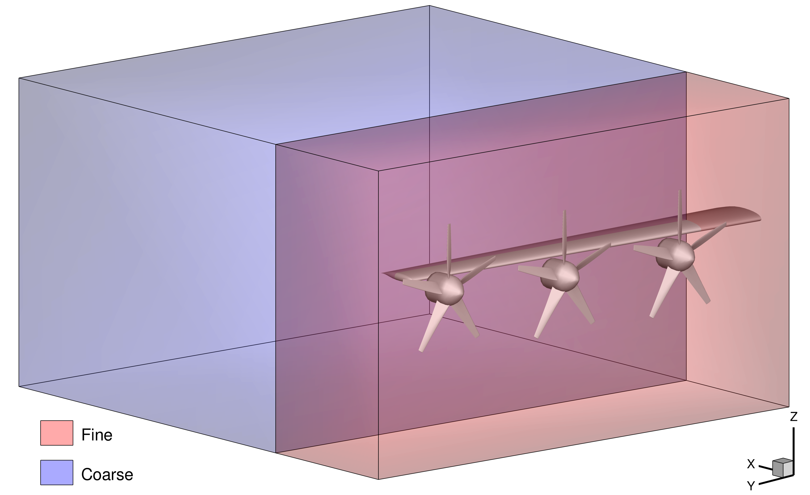

Mesh Generation
===============

The mesh required for this study requires not only good resolution near the wing surface, but also in the actuator zone regions.
This resolution away from the walls is necessary to accurately capture the actuator zone influence in the flow field.
To capture the actuator zones and the downstream wakes, we define two mesh refinement zones: a fine zone that encapsulates the propellers, and a coarse zone that contains the wake.
These refinement zones are shown in the image below, with the propellers for the nominal three-propeller case used to show where the propellers are embedded in the volume.
The refinement zones are substantially larger than the rendered propellers for the three-propeller case, as the single-propeller configuration requires a large zone given its increased radius.

   Schematic of the meshing process with the actuator zone refinement zone defined around the propeller locations.

We generated three meshes to understand the effect of mesh resolution on the quantities of interest.
For each mesh, we double the resolution of each dimension as well as the edge length specified for the actuator refinement zones.
The level, volume cells, and actuator zone values for each mesh resolution are shown in the table below. 

.. list-table:: Mesh refinement study parameters.
   :widths: 25 25 25 25
   :header-rows: 1

   * - Level
     - Volume Cells
     - Fine [m]
     - Coarse [m]
   * - 1
     - 52,162,308
     - 0.025
     - 0.05
   * - 2
     - 7,781,776
     - 0.05
     - 0.1
   * - 3
     - 1,491,852
     - 0.1
     - 0.2

If recreating the files from scratch, we recommend approximately 1.5 million cells to maintain a reasonable computational cost.
This resolution requires wall functions, which we have found to work well for cutting the computational cost of DAFoam optimizations, without sacrificing significant accuracy.
We recommend optimizing with the mesh parameters described as level 3 and a y+ value of 30.
We used each mesh to simulate the coefficients of lift and drag at each resolution and these results are shown below.
The straight line convergence shows good performance with cell refinement, showing that the results are predictable with increasing refinement.

.. subfigure:: AB
   :layout-sm: A|B
   :gap: 8px
   :subcaptions: below
   :name: Distributed propulsion configurations
   :class-grid: outline

   .. image:: ../images/meshStudy-CL.pdf
      :alt: (a)

   .. image:: ../images/meshStudy-CD.pdf
      :alt: (b)

   Mesh refinement results for (a) coefficient of lift and (b) coefficient of drag for all refinement levels.

To download the mesh files, navigate to the ``inputData/`` directory and run the ``getData.sh`` script, which requires the Python package ``gdown``.
Once the files are downloaded, run the ``preProcessing.sh`` script in the ``wingOnly/`` directory to prepare the mesh in the run directory.
The script is set to import the L3 mesh, but can be modified to import other mesh resolutions.
Once the pre-processing is complete, the case is setup and can be used for analysis and optimization.
